# RSUV Bit Packer - Overview
Using _**Renderer Shader User Value**_ ([RSUV](https://docs.unity3d.com/Manual/renderer-shader-user-value-intro.html)), introduced in **Unity 6.3**, allows setting unique properties per renderer, to be used in their material shaders, with no performance cost when using the _SRP Batcher_ (and _GPU Resident Drawer_).

The RSUV is a ```uint``` (32 bit unsigned integer), which requires packing data on the C# renderer side, and unpacking data on the HLSL shader side.
While packing and unpacking data is trivial, the _**RSUV Bit Packer**_ (package) aims at providing a user friendly workflow to design packing scheme and set Renderer Properties in the Editor or from a C# script.

# Workflow
The package allows you to define a packing scheme by adding "_**Renderer Properties**_", easily changing precision to fit in the 32 bits, then pack those properties and assign them to Renderers's RSUV and eventually fetch the properties' values in _Shader Graph_, using:
- a _**[Property Sheet](#property-sheet)**_ (asset) that eventually generates a _**Shader Include**_ using the new _**Shader Function Reflection API**_ to fetch the data in _**Shader Graph**_.
- a _**[Property Packer](#property-packer)**_ (component) that sets the value on renderers and exposes properties to Animation, C# and even Visual Scripting.

## Property Sheet
Create a new _**Property Sheet**_ using `Assets/Create/Rendering/RSUV Bit Packer/Property Sheet`.
This asset allows defining a packing scheme and properties default values, to be reused with several _**Property Packers**_ later.

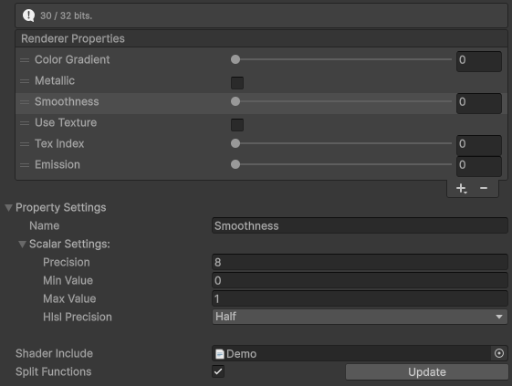

### Capacity
Some properties are fixed sized, like the Boolean Property which will only use one bit.
Other properties feature settings that allows adjusting their size, like the Scalar Property that features a precision setting.

At the top of a Renderer Property List, the Help Box displays how many bits are used, and the Add Menu grays out the fixed size properties that cannot fit.

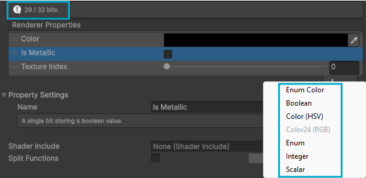

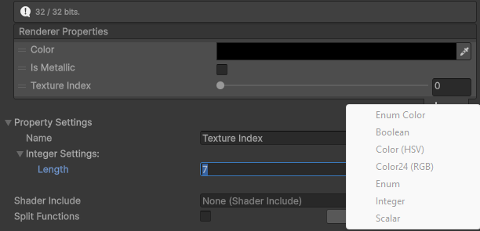

If the properties exceed the capacity, the Help Box turns into a warning, and any property that doesn't fit turns red.

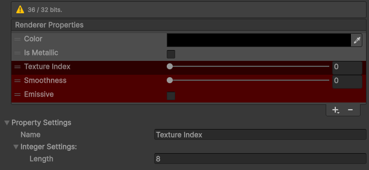

### Shader Includes
The _**Property Sheet**_ also allows generating a _Shader Include_ (HLSL) to access the properties in _Shader Graph_.

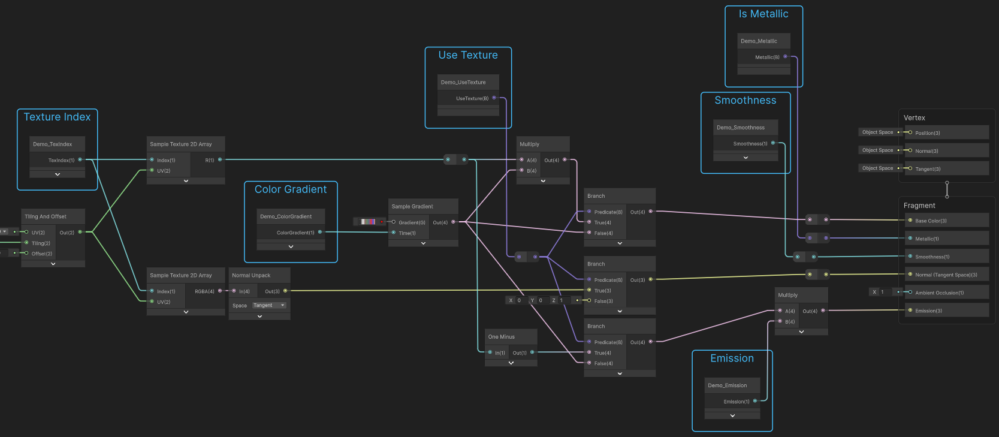

If the "Split Functions" option is enabled, it'll generate one function per property, otherwise it'll generate one function for all properties.

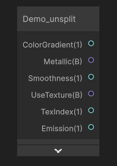

#### Unity 6.3 - 6.4
In Unity 6.3 and 6.4, Shader Includes are generated using the _Shader Graph Custom Function_ syntax for them to be used with _Custom Function Nodes_.

#### Unity 6.5 and above
In Unity 6.5, Shader Includes are generated using the _Shader Function Reflection API_ syntax, which makes them automatically accessible in _Shader Graph_ without having to manually configure a _Custom Function Node_.

## Property Packer
Add a _Property Packer_ to a GameObject using `Component/Rendering/RSUV Bit Packer/Property Packer`, and assign the Renderers it shall set the RSUV to.

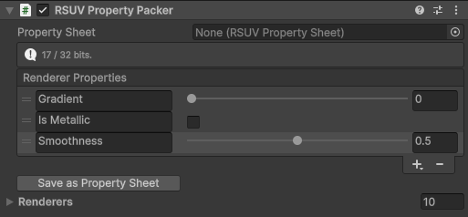

The list of Renderer Properties can be defined in the component, or inherited from a _Property Sheet_.
Assigning a Property Sheet on a Property Packer will make it inherits the properties from the sheet.

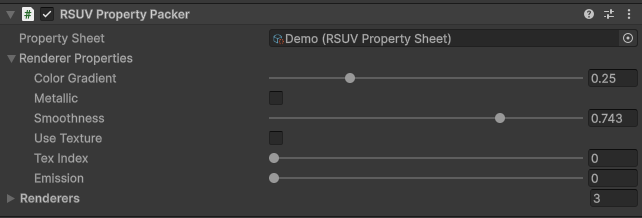

### Animation and Scripting

Properties are packed and set on the renderer when modified and/or animated in the Editor and at Runtime.

The API `PropertyPacker.TrySetProperty()` allows setting properties from C# at Runtime.

Note, it is good practice to store a property index using `PropertyPacker.GetPropertyIndex(string propertyName)` and use `PropertyPacker.TrySetProperty(int index, value)`.

It is also preferred to use the generic method `PropertyPacker.TrySetProperty<T>(int index, T value)`.

The main purpose of the non generic `PropertyPacker.TrySetProperty(int index, object value)` is for Visual Scripting support.

## Property Types
### Boolean
A boolean value stored on one bit.

### Integer
An integer value stored with custom precision.
The length determines the maximum value.
E.g.: 4 bits = max value 15, 5 bits = max value 31.

### Scalar
A float value stored with custom precision.

### Enum
Similar to int but displays as a dropdown.
The precision depends on the number of entries.
E.g.: 2 entries = 1 bit, 3-4 entries = 2 bits, 5-8 entries = 3 bits, and so on.

### Color24 (RGB)
Stores a color over 24 bits (8 bits per channel).

### Color (HSV)
Stores a color over variable precision per HSV channels.
If the saturation or value precision is set to 0, it defaults to one.

## Extras
### Color Palette
A Color Palette is an asset that allows defining colors and generating an HLSL Shader Include.

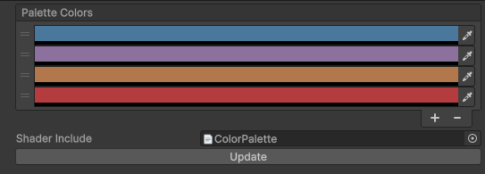

The generated HLSL allows getting a color from the palette in Shader Graph.

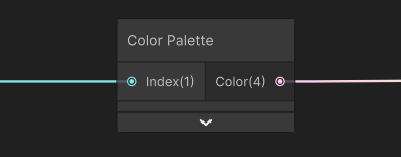

## Samples
To install samples, go to the Package Manager, select the package in the list and go to the Samples tab.

### Examples
This contains several examples of the different Renderer Properties.

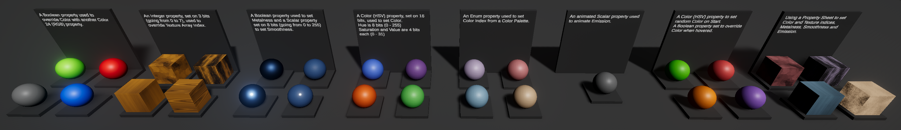

### More Renderer Properties
This contains a custom "Enum Color" Renderer Property, storing an index to a Color Array.

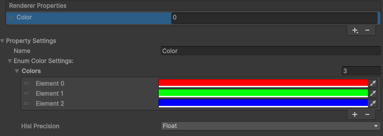

### Visual Scripting
This contains an example of setting a Renderer Property on a Property Packer from Visual Scripting.

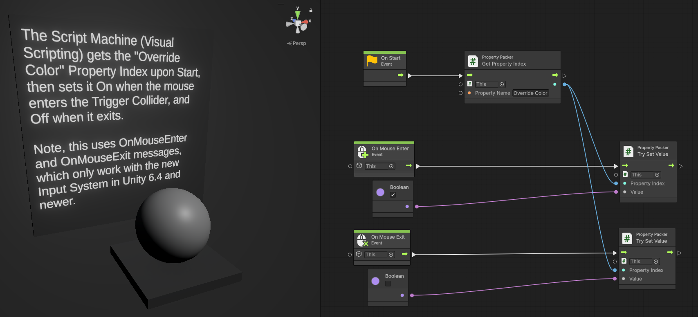

## Extensions
RSUV being implemented only on some `Renderer` classes, such as `MeshRenderer` and `SkinnedMeshRenderer`, this package contains an Extension that makes it easy to set the `ShaderUserValue` on a `Renderer`.

## Writing Renderer Property Types
The package is easily extensible to add new Renderer Property types by simply providing their data encoding (C#) and decoding (HLSL).
One can be created from template using `Assets/Create/Scripting/RendererProperty`.

```
using UnityEngine.RSUVBitPacker;
// RendererValue Attributes are used by the PropertyList.
[System.Serializable]
[RendererValueTypeName("NewRendererProperty")] //The name of the 'Add' Dropdown MenuItem.
//[RendererValueTypeLength(1)] // If used, the MenuItem will be grayed out if the length is greater than remaining bits available.
[RendererValueTypeTooltip("A single bit storing a boolean value.")] // 
public class NewRendererProperty : RendererProperty<bool> // the type defines the serialized value type
{
    // This is used to offset bitshift index.
    public override uint Length => 1;
    
    // This is expected to provide the data, as a uint, of which only the first n bits are used.
    public override uint Data => Value ? 1u : 0u;

    // The next two overrides are not mandatory. They are used by the HLSL generator.
    // If left unoverriden, the property value will not be featured in the generated Shader Include.
    // This is used to write the 'out' parameter.
    public override string HlslType => "bool";

    // This is used to write the parameter assignment in the shader function body.
    // rsuv is short for unity_RendererUserValue.
    // paramName is the name of the property as set by the user.
    // bitIndex is where the data storage begins in the rsuv uint.
    public override string HlslDecoder(string paramName, uint bitIndex) => $"{paramName} = (rsuv & (1 << {bitIndex})) != 0;";
}
```

## Known limitations and potential future improvements
### Property Names
There is no check on property names other than whitespace removal.
Don't give several properties the same name, and don't name properties with HLSL types or intrisic functions like "float" or "dot".

### IPropertyProvider
Considered for future improvement to add an interface for MonoBehaviours to provide renderer properties.

#### HLSL Namespacing
The generated includes are not namespaced. Adding namespacing may avoid collisions with other functions.
